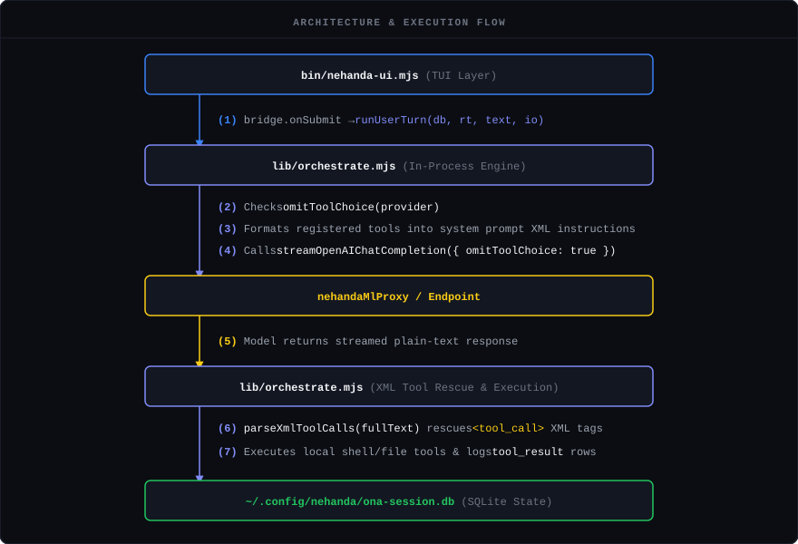

# Nehanda Command-Line Interface (`nehanda-cli`)

An agentic terminal REPL and single-process engine built for governed AI deep research and software development. `nehanda-cli` connects directly to our flagship [Nehanda v3](https://huggingface.co/asoba/nehanda-v3-27b), as well as local or cloud-based Ollama models, LM Studio instances, or any OpenAI-compatible API.

Every conversation turn, tool call, phase transition, and permission check is stored in a local, queryable SQLite database you own, ensuring complete transcripts exist for auditing and debugging.


---

## Getting Started

### Requirements

* **Node.js**: v22.0.0 or higher
* **SQLite**: Local SQLite runtime support

### 1. Installation

```bash
git clone [https://github.com/AsobaCloud/nehanda-cli.git](https://github.com/AsobaCloud/nehanda-cli.git)
cd nehanda-cli
npm install

```

### 2. Launching the REPL

Launch the interactive Ink TUI:

```bash
npm start
# or directly run:
node bin/nehanda-ui.mjs

```

### 3. Provider Setup

#### Option A: Nehanda Cloud (Default)

The CLI defaults to the primary Nehanda endpoint (`https://nehanda-ml.asoba.co/v1`). If an API key is required:

```
❯ /key
New Nehanda API key: <your-key>

```

#### Option B: Local LM Studio

Start LM Studio locally on port `1234` or `8000`, then start the CLI. Select or switch models via:

```
❯ /model

```

#### Option C: Remote Ollama over LAN

To connect to an Ollama instance running on your network:

```
❯ /config base_url [http://AsobaCorp-1.local:11434/v1](http://AsobaCorp-1.local:11434/v1)
❯ /model ollama/deepseek-coder-v2:latest

```

---

## Key Features

* **In-Process Engine:** Executes turns directly inside the process via `runUserTurn`, eliminating separate server daemons or background HTTP relays.

* **Dynamic Tool Rescue (`[TOOL_CALL]`):** Native support for endpoints that strip OpenAI tool schemas (such as `nehandaMlProxy`). The engine dynamically injects active tool schemas directly into system prompts as `[TOOL_CALL]` blocks, parsing and executing tools locally without server-side function-calling support. Uses `[TOOL_CALL]` delimiters instead of `<tool_call>` XML to prevent vLLM's `--tool-call-parser qwen3_xml` stop-token interception.

* **Deterministic SDLC Workflow:** Enforces a 6-phase state machine (`idle` → `plan` → `implement` → `test` → `verify` → `done`) to prevent unapproved code changes, hallucinated test passes, or unverified implementations.

* **Interactive TUI & Pipe Support:** Rich Ink-based TUI (`bin/nehanda-ui.mjs`) for interactive development sessions, with headless pipe-mode support (`bin/agent.mjs`) for acceptance testing and automation.

* **Multi-Provider Switching:** Seamlessly switch between Nehanda 27B, local LM Studio, Ollama instances over LAN, Anthropic Claude, or any OpenAI-compatible API using `/model`.

---

## Architecture

`nehanda-cli` combines an Ink TUI with a deterministic orchestration engine:



---

## Tool Calling Architecture

The Nehanda vLLM deployment runs with `--tool-call-parser qwen3_xml` and `--enable-auto-tool-choice` flags. The `nehandaMlProxy` Lambda function strips `tools` and `tool_choice` from requests before forwarding to vLLM to avoid a Qwen3 chat template bug where the presence of a `tools` array causes system message ordering errors.

To enable tool calling despite this constraint, the engine uses a rescue path:

1. **System Prompt Injection:** `buildXmlToolInstructions()` injects tool schemas into the system prompt using `[TOOL_CALL]...[/TOOL_CALL]` delimiters.
2. **Late Directive Injection:** A `[SYSTEM DIRECTIVE]` is appended to the final user message to defeat token recency bias on reasoning models[cite: 5, 7].
3. **Model Generation:** The model emits tool calls in the `[TOOL_CALL]` format within its response text.
4. **Local Parsing & Execution:** `parseXmlToolCalls()` extracts and executes these calls locally via `executeBuiltinTool()`, continuing the execution loop even when backends return `finish_reason: "stop"`[cite: 5, 7].

### Why `[TOOL_CALL]` Delimiters?

The vLLM `--tool-call-parser qwen3_xml` flag registers `<tool_call>` XML tags as stop/intercept tokens. When the model emits them in plain text, vLLM terminates generation mid-sentence and hands off to its native parser—which returns nothing because the plain-text path never populates `message.tool_calls`. This results in truncated responses containing only thinking traces. 

Switching to `[TOOL_CALL]...[/TOOL_CALL]` delimiters bypasses vLLM's stop-token interception entirely, allowing the model to complete generation and return valid, parseable tool calls.

---

## Declarative Tool System

`nehanda-cli` supports a **zero-code tool configuration** pattern. Tools are registered by dropping a JSON config into `lib/tools/` and a corresponding script into `lib/scripts/`. No JavaScript changes are required.

### How It Works

1. On startup, `lib/tools.mjs` scans `lib/tools/*.json` and dynamically registers each tool.
2. Tool schemas are injected into the API `tools` array so the model can call them.
3. Phase visibility (`explore_only`, `planning_blocked`) and mandatory enforcement (`mandatory_in`) are driven by config metadata.
4. Prompt injection (`prompt.mandatory_instruction`, `prompt.available_hint`) is read from the config and injected into the appropriate SDLC phase system prompts automatically.

### Shipped Tools

| Tool | Script | What It Checks |
| --- | --- | --- |
| `AuditCodeIntegrity` | `lib/scripts/audit-code-integrity.py` | Lifecycle teardown parity, mock-theater tests, naming invariants, swallowed exceptions |
| `ShellSafetyChecker` | `lib/scripts/shell-safety-checker.sh` | Missing `set -euo pipefail`, background job silent failure risk, hardcoded credentials |
| `JsSafetyChecker` | `lib/scripts/js-safety-checker.cjs` | Duplicate functions, duplicate HTML element IDs, script block syntax errors |
| `PythonSafetyChecker` | `lib/scripts/python-safety-checker.py` | Bandit security issues, ruff lint, mutable default args, `eval`/`exec`/`pickle` usage |

All four are **mandatory in the test phase** and **available on-demand** in explore and idle phases.

### Adding a New Tool

Create a JSON config in `lib/tools/`:

```json
{
  "name": "MyNewTool",
  "description": "What the tool does.",
  "input_schema": {
    "type": "object",
    "properties": {
      "target": { "type": "string", "description": "Target path" }
    }
  },
  "phases": {
    "explore_only": true,
    "planning_blocked": false,
    "mandatory_in": ["test"]
  },
  "prompt": {
    "mandatory_instruction": "Run MyNewTool on the workspace to check for X.",
    "available_hint": "Checks for X, Y, and Z"
  },
  "execution": {
    "runtime": "python3",
    "script": "lib/scripts/my-new-tool.py",
    "args": ["{{target}}"],
    "default_timeout": 120000,
    "max_timeout": 600000
  }
}
```

Place the script at `lib/scripts/my-new-tool.py`. It will receive arguments interpolated from `args` and run with `cwd` set to the target workspace. **No JS code changes needed.**

---

## REPL Commands

| Command | Description |
| --- | --- |
| `/help` | Display available commands |
| `/model [name]` | Discover and switch active provider or model endpoint |
| `/key` | Save Nehanda API key |
| `/config` | View or set settings (e.g., `/config base_url <url>`) |
| `/mcp` | Manage MCP server connections (see below) |
| `/clear` | Clear conversation history and reset transcript state |
| `/retry` | Resend the last failed request |
| `/exit` | Exit the REPL |

### `/mcp` Sub-commands

| Sub-command | Description |
| --- | --- |
| `/mcp status` | List all configured MCP servers and their commands |
| `/mcp list` | Connect to each server and enumerate available tools |
| `/mcp reload [server]` | Re-read `mcp.json` and bust the tool cache (optionally for one server) |
| `/mcp add <name> <command> [args…]` | Register a new server and save it to `~/.config/nehanda/mcp.json` |

---

## MCP Client Configuration

`nehanda-cli` can consume tools from any external MCP server. Servers are configured in a standard `mcp.json` file using the same schema as Claude Desktop and other MCP clients.

**Config file locations** (both are read and merged at startup; project-local takes priority):

- `./mcp.json` — project-local, committed with the repo
- `~/.config/nehanda/mcp.json` — user global

**Example `mcp.json`:**

```json
{
  "mcpServers": {
    "filesystem": {
      "command": "npx",
      "args": ["-y", "@modelcontextprotocol/server-filesystem", "/path/to/dir"]
    },
    "powermcp": {
      "command": "npx",
      "args": ["-y", "harvard-powermcp"],
      "env": { "API_KEY": "your-key" }
    }
  }
}
```

At startup, `nehanda-cli` loads `mcp.json`, spawns the configured servers, and calls `tools/list` on each. Discovered tools are injected into the model's tool list under the namespace `mcp__<server>__<tool>` and are available for the model to call during any conversation turn — no additional configuration required.

Use `/mcp list` to verify what tools are visible, and `/mcp reload` to pick up changes without restarting.

---

## SDLC Workflow

The engine enforces state transitions across six distinct phases:

1. **`idle`**: Discovery and triage. Mutating file tools are physically masked out. Safety and analysis tools are available on-demand.

2. **`plan`**: Model formulates success criteria and implementation steps (`EnterPlanMode`). No tools available.

3. **`implement`**: Code changes applied using file editing and shell execution (`ExitPlanMode`).

4. **`test`**: Automated test generation and execution (`SubmitImplementation`). **After tests pass, all tools marked `mandatory_in: ["test"]` must be run.** The system prompt enforces this — the model cannot declare success until all mandatory safety checkers pass.

5. **`verify`**: Inspection of test outputs and coverage verification (`SubmitTest`).

6. **`done`**: Final sign-off and git commit creation.

---

## Database Schema

Session state is persisted locally at `~/.config/nehanda/ona-session.db`. Key tables include:

* `conversations`: Active workflow phases and project roots.


* `transcript_entries`: Sequence of user messages, assistant turns, tool calls, and results.


* `plans`: Content, hashes, and approval status for technical plans.


* `events`: SDLC milestones and test execution output.


---

## Testing & Verification

Run the acceptance suite:

```bash
npm run acceptance

```

Verify SDLC hook ordering:

```bash
npm run verify

```

---

## License

See [LICENSE](https://www.google.com/search?q=LICENSE) for details.