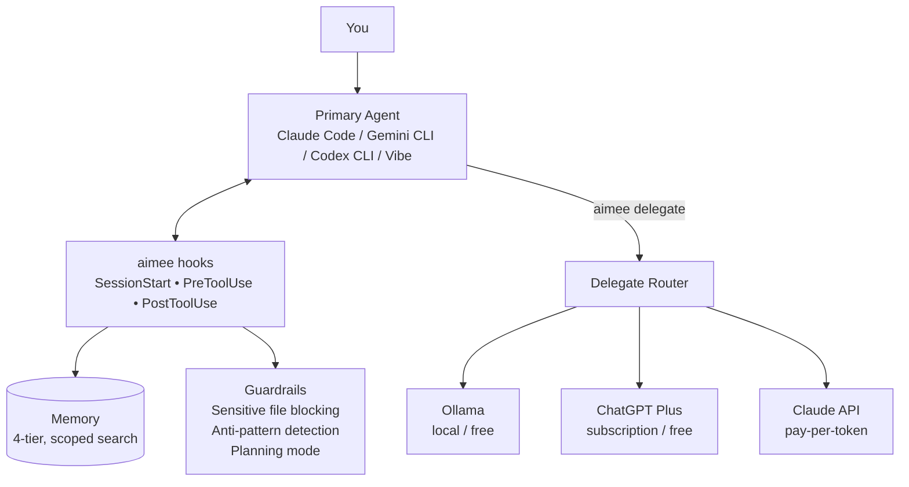
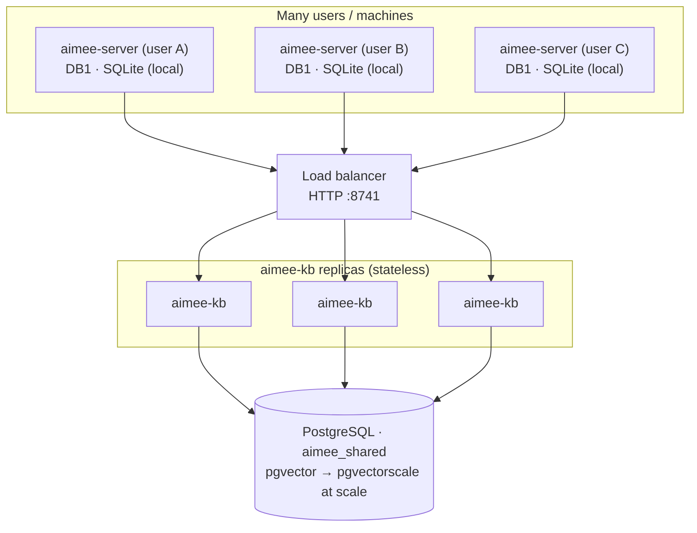

# aimee

**Your company's collective memory, that learns.** aimee distills what your whole organization knows, across engineering, product, sales, support, and operations, into one self-learning knowledge base, draws conclusions across every domain, and routes work to the cheapest capable model to keep costs down. Zero cloud dependencies, sub-10ms.

It **starts as persistent memory for your AI coding tool**, one install, and every session starts knowing what the last one learned, adding memory, safety guardrails, and cost-saving delegation to Claude Code, Gemini CLI, Codex CLI, Mistral Vibe, and GitHub Copilot. The *same substrate* scales up to a company-wide knowledge base. See **[How aimee learns](docs/KNOWLEDGE.md)**.

Four shipped artifacts: `aimee`, `aimee-webchat`, `aimee-server`, and `aimee-kb`. Client and webchat talk only to the local `aimee-server`; local runtime information stays in server-owned DB1, while knowledge lives behind `aimee-kb` in DB2, which can be a local or shared Postgres service. Zero cloud dependencies. The core services are C; the browser webchat is the standalone Go service in `webchat/`. Starts in under 10ms.

## The problem

Every AI coding session starts from scratch. Your AI tool doesn't remember your infrastructure, your preferences, your past mistakes, or even what it did five minutes ago in a different session. You spend tokens re-explaining context, re-discovering your codebase, and correcting the same errors over and over.

Meanwhile, there's nothing stopping it from overwriting your `.env`, editing production configs, or clobbering another session's work.

## What aimee does

aimee sits between you and your AI tool, intercepting actions through hooks and MCP. The CLI surface is `aimee`; browser chat starts with `aimee-webchat`.



### Memory that compounds, and a knowledge base that learns

A 4-tier memory system tracks project context, infrastructure details, preferences, and past outcomes. Facts are deduplicated, contradictions are detected, and stale information decays automatically. Your AI starts every session already knowing what matters -- no re-discovery, no repeated questions.

That's the on-ramp. aimee doesn't just *store*, a curator pipeline **extracts, synthesizes, judges, and promotes** knowledge into a typed graph, and reflects on idle time to improve it. Point a team at a **shared `aimee-kb`** and it distills *everyone's* knowledge to *everyone*, across all domains, not just code. The longer you use it, the more it learns you. See **[How aimee learns](docs/KNOWLEDGE.md)**.

```bash
aimee memory store db-host "PostgreSQL at 10.0.0.5:5432" --tier L2 --kind fact
aimee memory search "database"
aimee rules generate
```

### Guardrails that prevent costly mistakes

Before every file edit, aimee classifies the target. Sensitive files (`.env`, credentials, private keys) are blocked before the AI touches them. Known anti-patterns from past failures trigger warnings. Planning mode locks all writes until you're ready to implement.

### Delegation that cuts your bill

Route summarization, formatting, code review, and boilerplate to cheaper models. The primary agent receives a compact result instead of processing raw content, so you save on the delegate *and* on the expensive primary agent's context. Local models via Ollama cost nothing; subscription-plan delegates (ChatGPT Plus, `mistral-plan`) cost nothing extra. The router automatically picks the cheapest delegate that can handle the job, and the economics layer tracks cost and success per delegate so routing improves over time.

```bash
aimee delegate review "Review this PR"     # routes to cheapest capable delegate
aimee delegate code --tools "Add tests"    # delegate with file read/write access
```

### Session isolation that just works

Each session gets its own git worktree, state file, and branch. Run two sessions in parallel and they never clobber each other's work. Read-only delegates inspect the parent session worktree directly; write-capable delegates get isolated sibling worktrees.

### Works with what you already use

| Tool | Integration | Setup |
|------|------------|-------|
| Claude Code | Full hook support + MCP | `./install.sh` |
| Gemini CLI | Full hook support | `./install.sh` |
| Codex CLI | Full hook support + MCP + local plugin | `./install.sh` |
| Mistral Vibe | Provider-CLI primary and subscription-plan delegates, including `mistral-plan` | `aimee agent setup mistral-plan` |
| GitHub Copilot | MCP server | `./install.sh` |
| VS Code | MCP tools in Copilot Chat, or aimee as an OpenAI-compatible model | [VS Code guide](docs/VSCODE.md) |

Switch tools any time. aimee keeps all your memory and context.

## Performance

aimee is designed to be invisible. Hook checks happen in the critical path between the AI and every file edit, so they have to be fast.

| Operation | p50 | p99 |
|-----------|-----|-----|
| Hook pre-tool check | 1ms | 19ms |
| Session startup | 8ms | 13ms |
| Memory search | 7ms | 18ms |

## How aimee scales

aimee's scaling model follows its storage boundary exactly: the per-user state and
the shared knowledge live in different processes, and each scales in its own way.



- **`aimee-server` is 1:1 with a user.** It owns local, same-user state (DB1 /
  SQLite) and authenticates by peer UID, so each developer runs exactly one server
  on their own machine. It is single-tenant and local by design — you never shard
  or replicate it.
- **`aimee-kb` is the shared, horizontally-scalable tier.** All of its durable
  state lives in Postgres; a KB process is otherwise a stateless request server
  plus background workers. One KB deployment serves *many* `aimee-server`
  instances — i.e. many users — and you scale it by running **multiple `aimee-kb`
  replicas behind a load balancer** on HTTP `:8741`. Even the ingest/curator
  workers coordinate purely through Postgres (`FOR UPDATE SKIP LOCKED`), so adding
  replicas needs no external coordinator.
- **The database is just standard Postgres.** No bespoke datastore: knowledge rows
  and their vector embeddings live in one Postgres database (`aimee_shared`) with
  the `pg_trgm` and `vector` (pgvector) extensions. Scale it like any Postgres —
  bigger instance, connection pooling, read replicas. For large vector corpora,
  add **`pgvectorscale`** (StreamingDiskANN): it sits on top of pgvector with
  identical data and queries, so switching is a reindex, not a migration. Small and
  local installs stay on plain pgvector (HNSW) with nothing extra to install.

See the [Manual](MANUAL.md#275-scaling-and-multi-user-deployment) and
[Architecture](docs/ARCHITECTURE.md) for the full deployment topologies.

## Install

### Prerequisites

| Package | Debian/Ubuntu | macOS |
|---------|---------------|-------|
| C compiler | `apt install build-essential` | Xcode CLT |
| SQLite3 | `apt install libsqlite3-dev` | System SQLite |
| libpq | `apt install libpq-dev` | `brew install libpq` |
| libcurl | `apt install libcurl4-openssl-dev` | `brew install curl` |

### Install

```bash
git clone https://github.com/RakuenSoftware/aimee.git
cd aimee
./install-deps.sh   # system packages + PostgreSQL bootstrap (uses sudo)
./install.sh        # build + install + configure (no sudo)
```

`install-deps.sh` installs the system packages aimee builds against and bootstraps the `aimee_shared` PostgreSQL database, the only steps that need root. `install.sh` then builds from source, installs to `~/.local/bin/`, installs service units where supported, and configures hooks for every detected AI coding tool (it also registers the MCP server for tools that support it). If a dependency is missing, `install.sh` stops and points you back at `install-deps.sh`.

**Local or remote knowledge base.** `install.sh` asks whether to run `aimee-kb` **locally** (the default — backed by the local Postgres) or point at an existing **remote** `aimee-kb` over HTTP. Choosing remote persists `kb_client_url` (and an optional bearer token) to `aimee.yaml`, skips the local sidecar and Postgres, and `aimee-server` reaches the remote kb on every launch path. For a remote-only host, also skip the database bootstrap: `AIMEE_KB_MODE=remote ./install-deps.sh`.

### Verify

```bash
aimee version
aimee status
```

If `aimee status` cannot reach the socket, start the service with `systemctl --user start aimee-server` on systemd systems, or use `aimee server start` as the cross-platform fallback.

### Thin client against a remote server

The `aimee` CLI is a thin client: by default it talks to a local `aimee-server`
over a Unix-domain socket. To drive a **remote** `aimee-server` from macOS,
Linux, or Windows, point the client at the server's TCP listener
(`server_api_http_port` + `server_api_bearer_token` on the server):

```bash
# Per-invocation:
aimee --server http://my-host:8390 --server-token=SECRET status

# Or via environment (applies to every command):
export AIMEE_SERVER_URL=http://my-host:8390
export AIMEE_SERVER_TOKEN=SECRET
aimee status

# Or persist it (stored in <aimee_home>/remote.conf):
aimee remote set http://my-host:8390 SECRET
aimee remote status   # shows the resolved transport + a /v1/health probe
aimee remote clear    # revert to the local Unix socket
```

Precedence is `--server` flag > `AIMEE_SERVER_URL` env > persisted `remote.conf`.

`https://` URLs are supported on Linux/macOS builds (OpenSSL), with certificate
verification on by default — set `AIMEE_TLS_INSECURE=1` for self-signed/dev
servers. The Windows thin client is built without TLS and refuses `https://`;
terminate TLS at a reverse proxy and use its `http://` address there. Prebuilt
thin-client binaries for Linux, macOS, and Windows are attached to each GitHub
release.

#### Build just the thin client

For packaging hosts that should ship only the `aimee` CLI (no `aimee-server`,
`aimee-kb`, gateway, or webchat), configure with `-DAIMEE_THIN_CLIENT=ON`.
That option restricts the build to the `aimee` target, so the box needs only
a C compiler — no Go, libpq, or zstd. Combine with `-DAIMEE_LEAN=ON` to add
the size-optimized strip. Add OpenSSL on Linux/macOS to keep `https://`
support (the default for the thin client); skip it on Windows and terminate
TLS at a reverse proxy.

**Linux / macOS:**

```bash
cmake -B build -DAIMEE_THIN_CLIENT=ON -DAIMEE_LEAN=ON \
      -DWITH_PAM=OFF -DWITH_LIBSECRET=OFF -DWITH_UI=OFF
cmake --build build --target aimee
```

**macOS (Homebrew OpenSSL is keg-only — point CMake at it):**

```bash
cmake -B build -DAIMEE_THIN_CLIENT=ON -DAIMEE_LEAN=ON \
      -DOPENSSL_ROOT_DIR="$(brew --prefix openssl@3)" \
      -DWITH_PAM=OFF -DWITH_LIBSECRET=OFF -DWITH_UI=OFF
cmake --build build --target aimee
```

**Windows (MinGW, no TLS — use a TLS-terminating proxy for `https://`):**

```bash
cmake -B build -G "MinGW Makefiles" \
      -DAIMEE_THIN_CLIENT=ON -DAIMEE_LEAN=ON \
      -DWITH_PAM=OFF -DWITH_LIBSECRET=OFF -DWITH_UI=OFF -DWITH_TLS=OFF
cmake --build build --target aimee
```

The resulting binary is the same thin client described above. Point it at a
remote `aimee-server` with `--server http://host:port` or by exporting
`AIMEE_SERVER_URL`; precedence and TLS behavior match the section above.

## Quick start

```bash
# Store a fact the AI will remember across sessions
aimee memory store myhost "PVE at 10.0.0.1" --tier L2 --kind fact

# Search memory
aimee memory search "proxmox"

# Delegate routine work to a cheaper model
aimee delegate review "Review this PR for security issues"

# Store scratch state for the current session
aimee wm set current-task "Review PR for security issues"

# Check system health
aimee status
```

## Run in Docker

Four compose files ship for container deploys; pick by topology. They build
from three reusable images: **`aimee-server`** (`Dockerfile.server`),
**`aimee-kb`** (`Dockerfile`), and **`aimee-server+kb`** (`Dockerfile.combined`).

| File | Brings up | Use when |
|------|-----------|----------|
| `compose.yaml` | `aimee-kb` + Postgres (pgvector) + embedder | You want the knowledge service (DB2 + vectors) on its own |
| `compose.server.yaml` | `aimee-server` + `aimee-kb` + Postgres + embedder | Full split stack: server `/v1` on `:8740`, kb `/v1` on `:8741` |
| `compose.combined.yaml` | `aimee-server+kb` (one container) + Postgres + embedder | Both binaries co-located in one image; server `/v1` on `:8740` |
| `compose.server-standalone.yaml` | `aimee-server` only (SQLite DB1, no kb) | DB1-backed `/v1` endpoints with no shared knowledge |

### aimee-kb

```bash
docker compose -f compose.yaml up --build
```

This builds the slim kb image, starts a `pgvector/pgvector:pg16` Postgres, and
brings up the resident embedder (`all-MiniLM-L6-v2`). The kb auto-applies its
DB2 schema (tables + `pg_trgm`/`vector` extensions) on first boot and serves the
`/v1` HTTP API on `:8741`:

```bash
curl http://localhost:8741/v1/health
curl 'http://localhost:8741/v1/health?status=1'   # DB + pgvector store status
curl http://localhost:8741/v1/capabilities
```

The LLM-backed synthesis/curator passes are wired but disabled until you point
an OpenAI-compatible endpoint at them — bring up a local llama.cpp server with
`docker compose -f compose.yaml --profile llm up`.

### Full server + kb stack

```bash
docker compose -f compose.server.yaml up --build
```

The server fronts the `/v1` API on `:8740` (bearer `aimee-local-dev`) and reaches
the kb over HTTP (`AIMEE_KB_API_URL`); the kb owns Postgres + the embedder. The
server-routed knowledge endpoints prove the wiring:

```bash
curl -H 'Authorization: Bearer aimee-local-dev' http://localhost:8740/v1/health
curl -H 'Authorization: Bearer aimee-local-dev' http://localhost:8740/v1/kb/status
```

Both server stacks mount a dedicated **`aimee-server-workspaces`** volume at
`AIMEE_WORKSPACES_DIR` (`/var/lib/aimee-workspaces`). A detached/`mirror`
workspace keeps its server-side bare mirror and reconstructed worktree there, so
the checkouts survive container recreation; the image also declares it a `VOLUME`,
so even a plain `docker run` persists them in an anonymous volume.

### Combined server+kb image

```bash
docker compose -f compose.combined.yaml up --build
```

One `aimee-server+kb` container runs **both** binaries co-located: the kb on
loopback `:8741` inside the container and the server fronting `:8740` with
`AIMEE_KB_API_URL=http://127.0.0.1:8741`. Postgres + the embedder stay external
(the image bundles the two aimee binaries, not a database). Same server-routed
proof as the split stack:

```bash
curl -H 'Authorization: Bearer aimee-local-dev' http://localhost:8740/v1/kb/status
```

### Verify a stack end to end

Each stack ships a smoke test that brings it up, waits for health, exercises the
live surface (DB + vector readiness, search, embeddings, and — for the server
stacks — the server→kb path), then tears down. `e2e-matrix.sh` runs several at
once and prints one pass/fail table (run it on a Docker host, e.g. inside CT 101):

```bash
scripts/aimee-kb-docker-smoke.sh --up --down                  # T1 kb-only
scripts/aimee-server-docker-smoke.sh --up --down              # T2 server + kb split
scripts/aimee-server-standalone-docker-smoke.sh --up --down   # T3 server standalone
scripts/aimee-combined-docker-smoke.sh --up --down            # T4 combined server+kb
scripts/e2e-matrix.sh --only T1,T2,T3,T4                      # all Docker topologies
```

The full topology × platform matrix (including local-install T5/T6 and the
cross-platform thin-client smoke) is documented in
[docs/proposals/pending/aimee-e2e-deploy-matrix.md](docs/proposals/pending/aimee-e2e-deploy-matrix.md).

### Drive a remote server with the CLI

The `aimee` CLI normally talks to a co-located server over a Unix socket. To
point it at a server reachable only over the network — e.g. a container's
published `:8740` — select the HTTP transport and a remote endpoint:

```bash
export AIMEE_API_CLIENT_TRANSPORT=http
export AIMEE_API_ENDPOINT=tcp:HOST:8740     # or unix:/path/to/aimee-http.sock
export AIMEE_API_BEARER=aimee-local-dev     # must match the server's bearer
aimee session list
aimee memory search "<query>"
```

The same settings persist in `aimee.yaml` (`aimee.api.client_transport`,
`aimee.api.client_endpoint`, `aimee.api.bearer_token`); the environment
variables override them. The TCP host may be a DNS name or an IPv4/IPv6 literal
(`tcp:[::1]:8740`).

This drives the **data/RPC plane** (`memory`, `kb`, `rules`, `index`,
`sessions`, `notes`, …). Interactive **`aimee chat` / `aimee launch` need a
co-located server** — they run the agent and its tools on the client host and
chdir into a local worktree — so they refuse a remote `tcp:` endpoint with a
clear message rather than misbehaving.

**Remote writes are off by default** (leaked-bearer protection): over the TCP
listener a bearer is read/query/chat only, so mutating commands return 403. The
server opts in per `aimee.api.remote_writes`:

| `aimee.api.remote_writes` | Over the TCP listener |
|---------------------------|-----------------------|
| `off` (default) | **reads only** — any route needing a non-read capability is local-UDS-only (the detached-workspace plane — `workspace serve`/`add`/`remove` — is the deliberate exception, still bearer-gated) |
| `data` | + data-plane writes (`memory store`, `work …`, `rules delete`, `skill …`) |
| `full` | + exec/control (`delegate`, `cron`, `agent`, `provider`, `api`, …) and the `/v1/rpc` delegate/tool bridge (`CAPS_ALL`). **Trusted networks only** — a leaked bearer then permits remote code execution. |

The capability gate is fail-closed: a route is reachable over TCP only if its
required capability is satisfied *and* the tier permits its class. A scoped
`scope:…` bearer is query-only regardless of tier.

The UDS path (a co-located client) is always full access regardless of this
setting.

## Documentation

Start here:

| Document | Description |
|----------|-------------|
| **[How aimee learns](docs/KNOWLEDGE.md)** | **The vision and the mechanisms**, the company-wide knowledge base, self-learning pipeline, cross-domain synthesis, and delegation economics. |
| **[Manual](MANUAL.md)** | **The complete user reference**, installation, configuration, current command contract, and feature guides. |
| **[Architecture](docs/ARCHITECTURE.md)** | System design, processes, storage/trust boundaries, layering, and request lifecycles. |
| **[Technical Reference](src/README.md)** | Code-level internals, module map, server internals, RPC/HTTP surfaces, memory internals, build system. |

Focused references:

| Document | Description |
|----------|-------------|
| [Command Reference](docs/COMMANDS.md) | Client command contract, flags, and options |
| [Storage Tiers](docs/STORAGE_TIERS.md) | DB1 + DB2 ownership boundaries (pgvector inside DB2) |
| [Setting Up Delegates](docs/DELEGATES.md) | Configure delegate agents for task offloading |
| [Workspace Management](docs/WORKSPACES.md) | Multi-repo workspaces and session isolation |
| [Security Model](docs/SECURITY.md) | Threat model, trust boundaries, capability system |
| [Benchmarks](docs/BENCHMARKS.md) | Latency measurements and performance budget |
| [Compatibility](docs/COMPATIBILITY.md) | Supported OS, shell, and provider matrix |
| [VS Code Integration](docs/VSCODE.md) | Wire aimee into VS Code via MCP tools or as an OpenAI-compatible model |
| [Feature Status](docs/STATUS.md) | Implementation status of all features |
