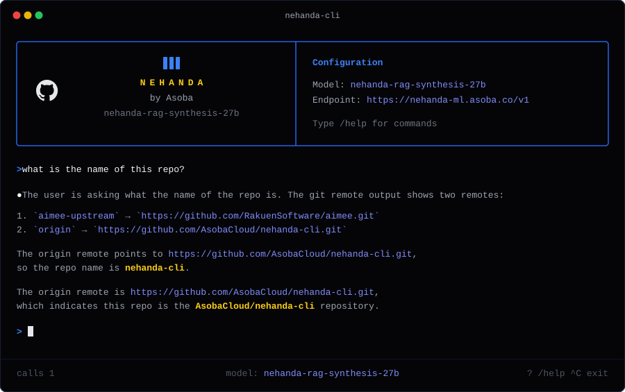

# Nehanda Command-Line Interface (`nehanda-cli`)

An agentic terminal REPL and single-process engine built for governed AI deep research and software development. `nehanda-cli` connects directly to our flagship [Nehanda v3](https://huggingface.co/asoba/nehanda-v3-27b), as well as local or cloud-based Ollama models, LM Studio instances, or any OpenAI-compatible API.

Every conversation turn, tool call, phase transition, and permission check is stored in a local, queryable SQLite database you own, ensuring complete transcripts exist for auditing and debugging.



---

## Getting Started

### Requirements

* **Node.js**: v22.0.0 or higher
* **SQLite**: Local SQLite runtime support

### 1. Installation

```bash
git clone [https://github.com/AsobaCloud/nehanda-cli.git](https://github.com/AsobaCloud/nehanda-cli.git)
cd nehanda-cli
npm install