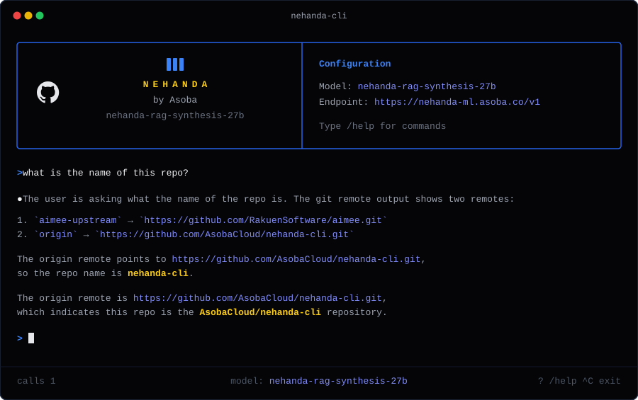
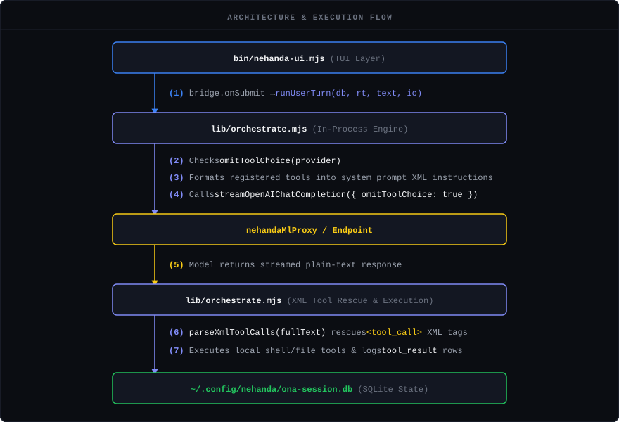

# Nehanda Command-Line Interface (`nehanda-cli`)

An agentic terminal REPL and single-process engine built for governed AI deep research and software development. `nehanda-cli` connects directly to our flagship [Nehanda v3](https://huggingface.co/asoba/nehanda-v3-27b), as well as local or cloud-based Ollama models, LM Studio instances, or any OpenAI-compatible API.

Every conversation turn, tool call, phase transition, and permission check is stored in a local, queryable SQLite database you own, ensuring complete transcripts exist for auditing and debugging.



---

## Getting Started

### Requirements

* **Node.js**: v22.0.0 or higher
* **Python**: 3.10 or higher (for the Laya System-1 control plane)
* **SQLite**: Local SQLite runtime support

### 1. Installation

**Global install (recommended):**

```bash
npm install -g @asobacloud/nehanda
```

During install, `npm` automatically provisions a dedicated Python venv and downloads the [Laya](https://huggingface.co/convaiinnovations/laya) checkpoint (~808 MB). This happens once — subsequent starts are instant.

**From source:**

```bash
git clone https://github.com/AsobaCloud/nehanda-cli.git
cd nehanda-cli
npm install
```

The same one-time provisioning runs automatically as part of `npm install`.

### 2. Launching the REPL

```bash
nehanda
```

Or via the aliases installed with the package:

```bash
ona
ona-code
```

### 3. Provider Setup

#### Option A: Nehanda Cloud (Default)

The CLI defaults to the primary Nehanda endpoint (`https://nehanda-ml.asoba.co/v1`). If an API key is required:

```
❯ /key
New Nehanda API key: <your-key>
```

#### Option B: Local LM Studio

Start LM Studio locally on port `1234` or `8000`, then start the CLI. Select or switch models via:

```
❯ /model
```

#### Option C: Remote Ollama over LAN

To connect to an Ollama instance running on your network:

```
❯ /config base_url http://AsobaCorp-1.local:11434/v1
❯ /model ollama/deepseek-coder-v2:latest
```

---

## Key Features

* **In-Process Engine:** Executes turns directly inside the process via `runUserTurn`, eliminating separate server daemons or background HTTP relays.

* **Jev-Mem Memory Architecture:** Every turn, a System-1 control plane ([Laya](https://huggingface.co/convaiinnovations/laya)) classifies observations into a multi-relational memory graph (semantic / temporal / causal / entity edges), then adaptively retrieves evidence before each model call. System-2 receives a compact canonical header + retrieved evidence + last 2 turns, not a raw transcript — cutting prefill 70–85% on long sessions. See [Jev-Mem Architecture](#jev-mem-architecture) below.

* **Dynamic Tool Rescue (`[TOOL_CALL]`):** Native support for endpoints that strip OpenAI tool schemas (such as `nehandaMlProxy`). The engine dynamically injects active tool schemas directly into system prompts as `[TOOL_CALL]` blocks, parsing and executing tools locally without server-side function-calling support. Uses `[TOOL_CALL]` delimiters instead of `<tool_call>` XML to prevent vLLM's `--tool-call-parser qwen3_xml` stop-token interception.

* **Deterministic SDLC Workflow:** Enforces a 6-phase state machine (`idle` → `plan` → `implement` → `test` → `verify` → `done`) to prevent unapproved code changes, hallucinated test passes, or unverified implementations.

* **Interactive TUI & Pipe Support:** Rich Ink-based TUI (`bin/nehanda-ui.mjs`) for interactive development sessions, with headless pipe-mode support (`bin/agent.mjs`) for acceptance testing and automation.

* **Multi-Provider Switching:** Seamlessly switch between Nehanda 27B, local LM Studio, Ollama instances over LAN, Anthropic Claude, or any OpenAI-compatible API using `/model`.

---

## Architecture

`nehanda-cli` combines an Ink TUI with a deterministic orchestration engine:



---

## Jev-Mem Architecture

`nehanda-cli` implements the memory architecture from **"System-One-Controlled Agentic Memory for Efficient AI Agents"** (Jiang, Li & Li, UT Dallas — [arXiv:2609.23986](https://arxiv.org/abs/2609.23986)). The core insight: the frequent, structured decisions of memory management — typing, relation judgment, retrieval routing, sufficiency assessment — don't need an autoregressive LLM. They need a fast, calibrated System-1 model.

The System-1 control plane is [**Laya**](https://huggingface.co/convaiinnovations/laya) — a 421M-parameter, non-autoregressive decision model (open weights, Apache 2.0) that answers typed questions in a single forward pass (~33 ms on GPU, ~200 ms on CPU). It never generates text, so there is nothing to parse and nothing to hallucinate.

```
Observation (user / tool / assistant turn)
        │
        ▼
┌── WRITE PATH (System 1 — Laya) ───────────────────────────────┐
│  type scores: episodic / semantic / procedural / preference   │
│  → deterministic TopK candidates (FTS + entities + recency)   │
│  → Laya relation judgments (semantic/causal/episode/entity)   │
│  → insert edges iff P(relation) ≥ θ_rel                       │
│  → update laya_jev_state (task_status, file_target, escalate) │
└───────────────────────────────────────────────────────────────┘
        │
        ▼  SQLite memory plane
   nodes  +  edges (semantic | temporal | causal | entity)
   + FTS/lexical index
        │
        ▼
┌── READ PATH (System 1 — Laya) ────────────────────────────────┐
│  route: which graph views matter for this query               │
│  → RRF anchors (FTS + recency)                                │
│  → assess sufficiency / utility / contradiction               │
│  → expand under budget → rescore → stop                       │
└───────────────────────────────────────────────────────────────┘
        │
        ▼
┌── SYSTEM 2 PROMPT ────────────────────────────────────────────┐
│  [CANONICAL SYSTEM 1 STATE]  (task_status, file_target, ...)  │
│  [RETRIEVED EVIDENCE]  (top-K memories, not raw transcript)   │
│  last 2 turns + last failed tool result                       │
└───────────────────────────────────────────────────────────────┘
```

### Paper invariants preserved

- Observations are always persisted on ingest — nothing is dropped on write.
- Candidate discovery is deterministic (FTS + recency) before any Laya relation judgments.
- Temporal and entity edges are derived from structure where possible; Laya is invoked only when needed.
- Retrieval is a closed loop: route → retrieve → assess → expand → reassess → stop on sufficiency.
- System-2 only synthesizes; it does not route, score, or stop the retrieval loop.

### Laya: the System-1 model

| | |
|---|---|
| Weights | [convaiinnovations/laya](https://huggingface.co/convaiinnovations/laya) — Apache 2.0, open weights |
| Size | 421M parameters (ModernBERT-large backbone + decision head) |
| Latency | ~33 ms / question on GPU; ~200 ms on CPU (MPS on Apple Silicon) |
| Training | RLCD — reinforcement learning against strictly proper scoring rules; honest probabilities are the only way to maximise reward |
| Question types | `noul` (probability), `choice` (categorical), `score` (ordinal) |
| Languages | English checkpoint (root); `laya-multilingual` covers 100+ languages |

On first startup, `lib/scripts/ensure-laya-env.sh` creates a dedicated venv at `~/.nehanda/venv` and downloads the checkpoint. The sidecar is then warmed before the first turn so all subsequent predictions hit the hot path. If provisioning fails, the CLI exits with a clear error — Laya is not an optional feature.

### Memory plane (SQLite)

The memory plane extends the existing `memories` table and adds `memory_edges` and `laya_jev_state`. All data lives in the same local SQLite database as the rest of the session state (`~/.config/nehanda/ona-session.db`).

| Table | Purpose |
|---|---|
| `memories` | Canonical node store — one row per observation, with overlapping type scores (episodic / semantic / procedural / preference), entity tags, and provenance |
| `memories_fts` | FTS5 index over memory content for lexical anchor retrieval |
| `memory_edges` | Multi-relational edges — same node pair may have independent semantic, temporal, causal, and entity edges |
| `laya_jev_state` | Session control block: `task_status`, `file_target`, `escalation_risk`, `confidence_score` |

---

## Tool Calling Architecture

The Nehanda vLLM deployment runs with `--tool-call-parser qwen3_xml` and `--enable-auto-tool-choice` flags. The `nehandaMlProxy` Lambda function strips `tools` and `tool_choice` from requests before forwarding to vLLM to avoid a Qwen3 chat template bug where the presence of a `tools` array causes system message ordering errors.

To enable tool calling despite this constraint, the engine uses a rescue path:

1. **System Prompt Injection:** `buildXmlToolInstructions()` injects tool schemas into the system prompt using `[TOOL_CALL]...[/TOOL_CALL]` delimiters.
2. **Late Directive Injection:** A `[SYSTEM DIRECTIVE]` is appended to the final user message to defeat token recency bias on reasoning models.
3. **Model Generation:** The model emits tool calls in the `[TOOL_CALL]` format within its response text.
4. **Local Parsing & Execution:** `parseXmlToolCalls()` extracts and executes these calls locally via `executeBuiltinTool()`, continuing the execution loop even when backends return `finish_reason: "stop"`.

### Why `[TOOL_CALL]` Delimiters?

The vLLM `--tool-call-parser qwen3_xml` flag registers `<tool_call>` XML tags as stop/intercept tokens. When the model emits them in plain text, vLLM terminates generation mid-sentence and hands off to its native parser — which returns nothing because the plain-text path never populates `message.tool_calls`. This results in truncated responses containing only thinking traces.

Switching to `[TOOL_CALL]...[/TOOL_CALL]` delimiters bypasses vLLM's stop-token interception entirely, allowing the model to complete generation and return valid, parseable tool calls.

---

## Declarative Tool System

`nehanda-cli` supports a **zero-code tool configuration** pattern. Tools are registered by dropping a JSON config into `lib/tools/` and a corresponding script into `lib/scripts/`. No JavaScript changes are required.

### How It Works

1. On startup, `lib/tools.mjs` scans `lib/tools/*.json` and dynamically registers each tool.
2. Tool schemas are injected into the API `tools` array so the model can call them.
3. Phase visibility (`explore_only`, `planning_blocked`) and mandatory enforcement (`mandatory_in`) are driven by config metadata.
4. Prompt injection (`prompt.mandatory_instruction`, `prompt.available_hint`) is read from the config and injected into the appropriate SDLC phase system prompts automatically.

### Shipped Tools

| Tool | Script | What It Checks |
|---|---|---|
| `AuditCodeIntegrity` | `lib/scripts/audit-code-integrity.py` | Lifecycle teardown parity, mock-theater tests, naming invariants, swallowed exceptions |
| `ShellSafetyChecker` | `lib/scripts/shell-safety-checker.sh` | Missing `set -euo pipefail`, background job silent failure risk, hardcoded credentials |
| `JsSafetyChecker` | `lib/scripts/js-safety-checker.cjs` | Duplicate functions, duplicate HTML element IDs, script block syntax errors |
| `PythonSafetyChecker` | `lib/scripts/python-safety-checker.py` | Bandit security issues, ruff lint, mutable default args, `eval`/`exec`/`pickle` usage |

All four are **mandatory in the test phase** and **available on-demand** in explore and idle phases.

### Adding a New Tool

Create a JSON config in `lib/tools/`:

```json
{
  "name": "MyNewTool",
  "description": "What the tool does.",
  "input_schema": {
    "type": "object",
    "properties": {
      "target": { "type": "string", "description": "Target path" }
    }
  },
  "phases": {
    "explore_only": true,
    "planning_blocked": false,
    "mandatory_in": ["test"]
  },
  "prompt": {
    "mandatory_instruction": "Run MyNewTool on the workspace to check for X.",
    "available_hint": "Checks for X, Y, and Z"
  },
  "execution": {
    "runtime": "python3",
    "script": "lib/scripts/my-new-tool.py",
    "args": ["{{target}}"],
    "default_timeout": 120000,
    "max_timeout": 600000
  }
}
```

Place the script at `lib/scripts/my-new-tool.py`. It will receive arguments interpolated from `args` and run with `cwd` set to the target workspace. **No JS code changes needed.**

---

## REPL Commands

| Command | Description |
|---|---|
| `/help` | Display available commands |
| `/model [name]` | Discover and switch active provider or model endpoint |
| `/key` | Save Nehanda API key |
| `/config` | View or set settings (e.g., `/config base_url <url>`) |
| `/mcp` | Manage MCP server connections (see below) |
| `/clear` | Clear conversation history and reset transcript state |
| `/retry` | Resend the last failed request |
| `/exit` | Exit the REPL |

### `/mcp` Sub-commands

| Sub-command | Description |
|---|---|
| `/mcp status` | List all configured MCP servers and their commands |
| `/mcp list` | Connect to each server and enumerate available tools |
| `/mcp reload [server]` | Re-read `mcp.json` and bust the tool cache (optionally for one server) |
| `/mcp add <name> <command> [args…]` | Register a new server and save it to `~/.config/nehanda/mcp.json` |
| `/mcp env` | Show environment variables for all configured servers |
| `/mcp env <server>` | Show environment variables for a specific server |
| `/mcp env <server> <KEY> <value>` | Set an environment variable (e.g. an API key) |
| `/mcp env <server> <KEY>` | Clear an environment variable |

---

## MCP Client Configuration

`nehanda-cli` can consume tools from any external MCP server. Servers are configured in a standard `mcp.json` file using the same schema as Claude Desktop and other MCP clients.

**Config file locations** (both are read and merged at startup; project-local takes priority):

- `./mcp.json` — project-local, committed with the repo
- `~/.config/nehanda/mcp.json` — user global

**Example `mcp.json`:**

```json
{
  "mcpServers": {
    "filesystem": {
      "command": "npx",
      "args": ["-y", "@modelcontextprotocol/server-filesystem", "/path/to/dir"]
    },
    "powermcp": {
      "command": "npx",
      "args": ["-y", "harvard-powermcp"],
      "env": { "API_KEY": "your-key" }
    }
  }
}
```

At startup, `nehanda-cli` loads `mcp.json`, spawns the configured servers, and calls `tools/list` on each. Discovered tools are injected into the model's tool list under the namespace `mcp__<server>__<tool>` and are available for the model to call during any conversation turn — no additional configuration required.

Use `/mcp list` to verify what tools are visible, and `/mcp reload` to pick up changes without restarting.

### Setting API Keys for MCP Servers

Many MCP servers require an API key or other secrets. Rather than editing `mcp.json` by hand, use the `/mcp env` command directly from the REPL:

```
❯ /mcp env                    # show env vars for all servers
❯ /mcp env asoba              # show env vars for 'asoba' server
❯ /mcp env asoba ASOBA_API_KEY sk-abc123...   # set the key
✓ Set ASOBA_API_KEY = ******** on asoba
  Config file: ~/.config/nehanda/mcp.json
```

This writes the value to the `mcp.json` file where the server is defined (project-local `./mcp.json` takes priority over global `~/.config/nehanda/mcp.json`), then automatically reloads the server so the change takes effect immediately.

To clear a key:

```
❯ /mcp env asoba ASOBA_API_KEY
✓ Cleared ASOBA_API_KEY on asoba
```

**Tip:** Keys are masked in `/mcp env` output. Only the first 6 and last 4 characters are shown.

#### Connecting to JupyterLab

`mcp.json` ships with a `jupyter` server pre-configured pointing at `localhost:8888`. To connect it to your JupyterLab instance:

```
❯ /mcp env jupyter JUPYTER_URL http://my-server:8888
❯ /mcp env jupyter JUPYTER_TOKEN <your-token>
```

Both values are written to `~/.config/nehanda/mcp.json` and never committed. The server reloads automatically.

### General Config from the REPL

Use `/config set <dot.path> <value>` to set any configuration value without editing files:

```
❯ /config set model_config.base_url https://api.anthropic.com
❯ /config set model_config.num_ctx 8192
```

Numeric values are auto-converted. Changes persist in the local settings database.

---

## SDLC Workflow

The engine enforces state transitions across six distinct phases:

1. **`idle`**: Discovery and triage. Mutating file tools are physically masked out. Safety and analysis tools are available on-demand.

2. **`plan`**: Model formulates success criteria and implementation steps (`EnterPlanMode`). No tools available.

3. **`implement`**: Code changes applied using file editing and shell execution (`ExitPlanMode`).

4. **`test`**: Automated test generation and execution (`SubmitImplementation`). **After tests pass, all tools marked `mandatory_in: ["test"]` must be run.** The system prompt enforces this — the model cannot declare success until all mandatory safety checkers pass.

5. **`verify`**: Inspection of test outputs and coverage verification (`SubmitTest`).

6. **`done`**: Final sign-off and git commit creation.

---

## Database Schema

Session state is persisted locally at `~/.config/nehanda/ona-session.db`. Key tables include:

* `conversations`: Active workflow phases and project roots.
* `transcript_entries`: Sequence of user messages, assistant turns, tool calls, and results.
* `plans`: Content, hashes, and approval status for technical plans.
* `events`: SDLC milestones and test execution output.
* `memories`: Jev-Mem canonical node store with overlapping type scores and entity provenance.
* `memory_edges`: Multi-relational graph edges (semantic / temporal / causal / entity).
* `laya_jev_state`: System-1 session control block (task_status, file_target, escalation_risk).

---

## Testing & Verification

Run the acceptance suite:

```bash
npm run acceptance
```

Verify SDLC hook ordering:

```bash
npm run verify
```

Run the Jev-Mem behavioral suite directly:

```bash
node tests/unit/jev_write_behavioral.mjs
node tests/unit/jev_read_behavioral.mjs
node tests/unit/compact_jev_behavioral.mjs
node tests/unit/orchestrate_jev_hotpath_behavioral.mjs
```

---

## Changelog

### 0.4.0
- **Runtime Visibility (`lib/modelDiscovery.mjs`, `lib/ui.mjs`):** New `RuntimeHealthMonitor` class probes active inference endpoints (1s HEAD request, Kubernetes readiness pattern) and checks Laya sidecar liveness via `pgrep`. `renderStatusHeader` and `renderModelSwitchNotice` added to `lib/ui.mjs` — the TUI now shows active model, endpoint health + latency, sidecar PID, and context usage percentage after startup and on every `/model` switch.
- **Structured Output Formatting (`lib/ui.mjs`, `lib/scripts/odse-transform.py`):** `formatToolResult` now detects JSON array payloads from tool responses and renders them as `cli-table3` box-drawing tables with column headers and row-count summaries (capped at 10 rows with overflow note), falling back to the plain-text preview for non-array content. `odse-transform.py` gains a `--format table|ndjson|summary` flag; defaults to `table` when stdout is a TTY and `ndjson` when piped.
- **Interactive Safety Interventions (`lib/bashguard.mjs`, `lib/tools.mjs`, `bin/nehanda-ui.mjs`):** `validateBashCommand` now returns a structured `{ status, reason, risk_score, proposed_remediation }` payload instead of a flat string. When the TUI is active, blocked commands raise a `BlockConfirmMenu` (`[A] Approve for Session | [S] Run in Laya Sandbox | [C] Cancel`) wired directly into the Ink event loop — no blocking readline, no crash. Session approvals are cached in-memory via `cacheSessionApproval` so the same operation is not re-prompted within a session. Safety checker scripts (`python-safety-checker.py`, `shell-safety-checker.sh`) emit the structured JSON payload to stderr on exit 1 so the TUI can surface them identically. Headless pipe mode auto-denies without prompting.
- **Pinned Context Preservation (`lib/store.mjs`, `lib/compact.mjs`):** New `pinned_context` table (schema v3) stores session-scoped invariants — ODSE schema mappings, asset specs, simulation bounds — keyed by string. `compactConversation` and `buildJevCollapseSummary` exclude pinned blocks from the distillation summariser and reattach them verbatim in the `collapse_commit` payload. `compactWithJev` prepends pinned blocks before the canonical System-1 header in every System-2 prompt, ensuring domain rules survive arbitrarily long sessions.
- Added `cli-table3@0.6.5` as a production dependency.
- Fixed dead `has_any_assert` variable in `lib/scripts/audit-code-integrity.py` (ruff F841).

### 0.3.0
- Published as `@asobacloud/nehanda` on npm — install with `npm install -g @asobacloud/nehanda`
- Laya System-1 venv provisioning moved to `npm install` time via `scripts/postinstall.mjs` — CLI starts instantly on every subsequent launch
- Laya provisioning now streams live pip progress to the terminal instead of running silently
- Added project-local `mcp.json` with `datalayer/jupyter-mcp-server` preconfigured for JupyterLab — set your server URL and token with `/mcp env jupyter JUPYTER_URL <url>` and `/mcp env jupyter JUPYTER_TOKEN <token>`

### 0.2.0
- Jev-Mem memory architecture (System-1 Laya control plane)
- Dynamic Tool Rescue (`[TOOL_CALL]` delimiter path)
- Deterministic 6-phase SDLC workflow
- Multi-provider switching

---

## References

Jiang, Z., Li, Y., & Li, J. (2026). *System-One-Controlled Agentic Memory for Efficient AI Agents*. arXiv:2609.23986. https://arxiv.org/abs/2609.23986

Convai Innovations. *Laya: Multilingual, non-autoregressive System-1 decision model.* Hugging Face. https://huggingface.co/convaiinnovations/laya

---

## License

See [LICENSE](LICENSE) for details.
